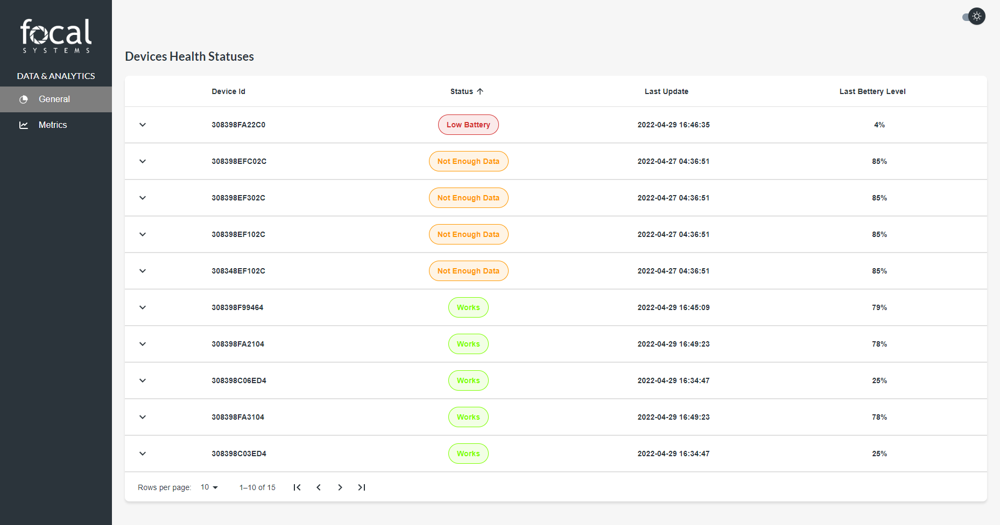
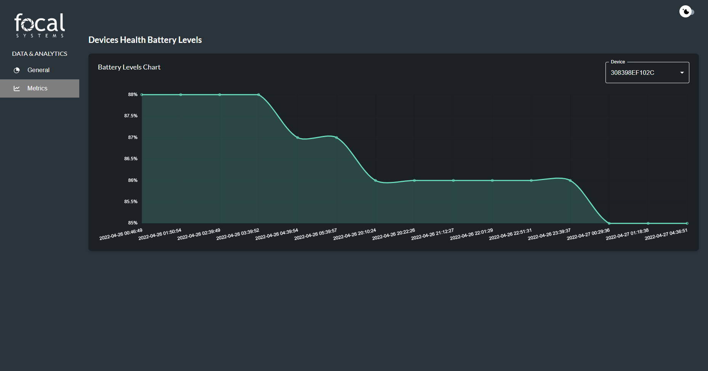

👋 Hello!

💻 Application: https://focal-systems-devices.netlify.app

👨‍💻 How to run the application?

Run:

1. ### `npm install`
2. When everything will be installed then move to another step
3. ### `npm start`

The application should be running on your default browser. Have fun! 😀

 
